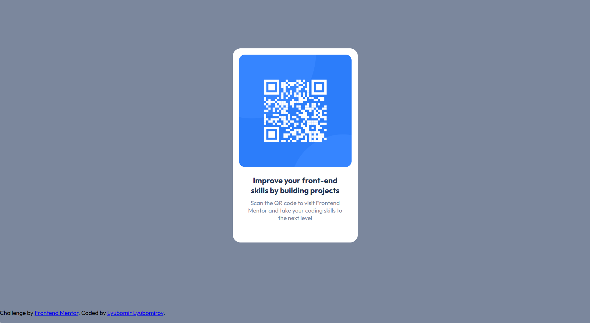

# Frontend Mentor - QR code component solution

This is a solution to the [QR code component challenge on Frontend Mentor](https://www.frontendmentor.io/challenges/qr-code-component-iux_sIO_H). Frontend Mentor challenges help you improve your coding skills by building realistic projects. 

## Table of contents

- [Overview](#overview)
  - [Screenshot](#screenshot)
  - [Links](#links)
- [My process](#my-process)
  - [Built with](#built-with)
  - [What I learned](#what-i-learned)

## Overview

### Screenshot


### Links

- Solution URL: [https://github.com/Ljubo6/qr-code-component](https://github.com/Ljubo6/qr-code-component)
- Live Site URL: [https://ljubo6.github.io/qr-code-component/](https://ljubo6.github.io/qr-code-component/)

## My process

### Built with

- Semantic HTML5 markup
- CSS custom properties
- Flexbox
- Mobile-first workflow

### What I learned
```css
:root{
  /*color*/
  --white: hsl(0, 0%, 100%);
  --light-gray: hsl(212, 45%, 89%);
  --grayish-blue: hsl(220, 15%, 55%);
  --dark-blue: hsl(218, 44%, 22%);

  /*typography*/
  --family: "Outfit", sans-serif;
  --fs-base: 15px;
  --fs-h3:20px;
  --weight-normal:400;
  --weight-bold:700;

  /*borders*/
  --radii: 20px;
  --radii-qr:15px
}

.container{
  min-height: 100vh;
  display: flex;
  justify-content: center;
  align-items: center;
}

@media (min-width: 1024px){
  .rectangle{
    width: 320px;
    height: 497px;
  }
}
```
